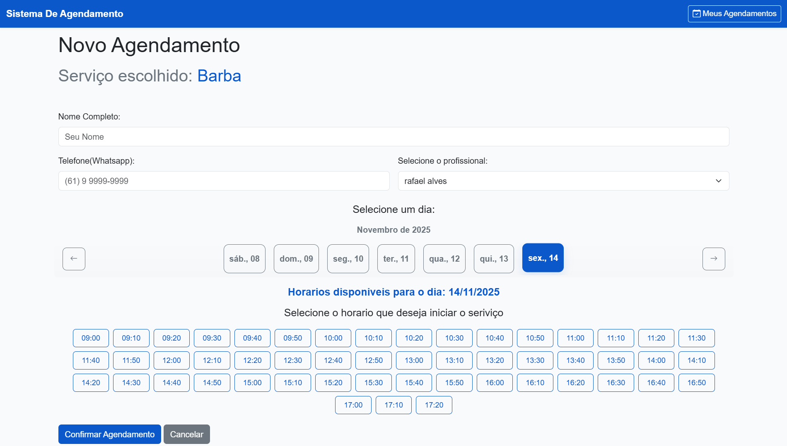
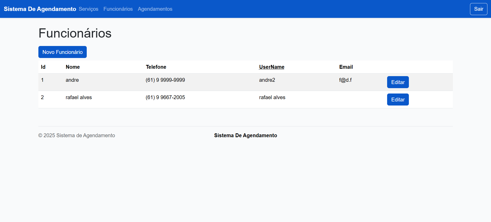
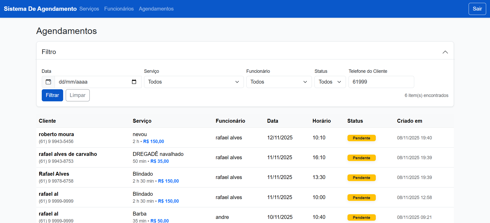

# 📅 Sistema de Agendamento

##[acesse aqui!](https://sistema-de-agendamento.azurewebsites.net/service/Read?fromHome=True)

Sistema completo de gestão de agendamentos desenvolvido em .NET 8.0, projetado para facilitar o agendamento de serviços, gestão de funcionários e controle de disponibilidade em tempo real.

---

## 🎯 Visão Geral

Sistema web robusto e escalável para gerenciamento de agendamentos de serviços, com suporte a múltiplos funcionários, horários de disponibilidade configuráveis e interface intuitiva para clientes e administradores.

---

## 🖼️ Screenshots

### Tela Principal / Dashboard
<!-- Adicione aqui uma captura de tela da tela principal -->


### Tela de Agendamento
<!-- Adicione aqui uma captura de tela da tela de criação de agendamento -->


### Gestão de Funcionários
<!-- Adicione aqui uma captura de tela da tela de gestão de funcionários -->


### Visualização de Agendamentos
<!-- Adicione aqui uma captura de tela da listagem de agendamentos -->


---

## 🛠️ Tecnologias e Ferramentas

### Backend
- **.NET 8.0** - Framework principal
- **C#** - Linguagem de programação
- **ASP.NET Core MVC** - Framework web
- **Entity Framework Core** (implícito via ADO.NET patterns)

### Banco de Dados
- **MySQL** - Banco de dados principal
- **SQL Server** - Suporte alternativo (multi-database)
- **ADO.NET** - Acesso direto a dados

### Frontend
- **Bootstrap 5.3.8** - Framework CSS responsivo
- **SASS** - Pré-processador CSS
- **Razor Pages** - Engine de views
- **JavaScript** - Interatividade

### Segurança e Autenticação
- **Cookie Authentication** - Sistema de autenticação
- **Role-Based Access Control (RBAC)** - Controle de acesso por perfil

### Ferramentas de Desenvolvimento
- **Visual Studio**
- **Git** - Controle de versão
- **npm** - Gerenciamento de pacotes frontend

---

## 🏗️ Arquitetura

O sistema foi desenvolvido seguindo os princípios de **Arquitetura em Camadas** e **Separation of Concerns**:

```
┌─────────────────────────────────────┐
│         Camada de Apresentação      │
│   (Controllers, Views, ViewModels)  │
└──────────────┬──────────────────────┘
               │
┌──────────────▼──────────────────────┐
│      Camada de Serviços             │
│   (Lógica de Negócio, Validações)   │
└──────────────┬──────────────────────┘
               │
┌──────────────▼──────────────────────┐
│      Camada de Repositório          │
│   (Acesso a Dados, Queries)         │
└──────────────┬──────────────────────┘
               │
┌──────────────▼──────────────────────┐
│         Banco de Dados              │
│   (MySQL / SQL Server)              │
└─────────────────────────────────────┘
```

### Padrões de Projeto Implementados

- **Repository Pattern** - Abstração do acesso a dados
- **Dependency Injection** - Inversão de controle
- **Service Layer Pattern** - Separação de lógica de negócio
- **DTO Pattern** - Transferência de dados entre camadas
- **Mapping Pattern** - Conversão entre entidades e DTOs

### Estrutura do Projeto

```
SistemaDeAgendamento/
├── SistemaDeAgendamento.Web/          # Camada de apresentação
│   ├── Controllers/                   # Controladores MVC
│   ├── Views/                         # Views Razor
│   ├── Models/                        # ViewModels
│   ├── Mappings/                      # Mapeamentos ViewModel ↔ DTO
│   └── wwwroot/                       # Arquivos estáticos
│
├── SistemaDeAgendamento.Services/     # Camada de serviços
│   ├── Models/                        # DTOs e Request/Response
│   ├── Mappings/                      # Mapeamentos Entity ↔ DTO
│   └── [Service]Service.cs            # Serviços de negócio
│
├── SistemaDeAgendamento.Repositories/ # Camada de acesso a dados
│   ├── Entities/                      # Entidades do domínio
│   └── [Entity]Repository.cs          # Repositórios
│
└── Scripts SQL/                       # Scripts de banco de dados
    ├── create_database.sql            # MySQL
    └── create_database_sqlserver.sql  # SQL Server
```

---

## ✨ Principais Funcionalidades

### 👥 Gestão de Usuários e Autenticação
- Sistema de login com autenticação por cookies
- Controle de acesso baseado em roles (Admin e Employee)
- Sessões com expiração configurável
- Proteção de rotas por autorização

### 👨‍💼 Gestão de Funcionários
- Cadastro completo de funcionários (nome, telefone, email)
- Vinculação de funcionários a usuários do sistema
- Gestão de disponibilidade por dia da semana
- Configuração de horários de trabalho (início e fim)
- Ativação/desativação de disponibilidades

### 🎯 Gestão de Serviços
- Cadastro de serviços com nome, preço e duração
- Edição e exclusão de serviços
- Listagem completa de serviços disponíveis

### 📅 Sistema de Agendamentos
- **Criação de agendamentos:**
  - Seleção de serviço
  - Seleção de funcionário
  - Cálculo automático de horários disponíveis
  - Validação de conflitos de horário
  - Cadastro rápido de clientes durante o agendamento
  
- **Visualização e filtros:**
  - Listagem completa de agendamentos
  - Filtros por data, serviço, status, funcionário e telefone do cliente
  - Visualização diferenciada por perfil (Admin, Employee, Cliente)
  - Busca por telefone do cliente (com normalização automática)

- **Status de agendamentos:**
  - Agendado (Scheduled)
  - Concluído (Completed)
  - Cancelado (Canceled)

### 👤 Gestão de Clientes
- Cadastro automático durante agendamento
- Busca de agendamentos por telefone
- Armazenamento de telefone em cookies para facilitar consultas futuras

### 🎨 Personalização (Branding)
- Configuração de nome do negócio
- Suporte a logo customizado
- Configuração de favicon
- Opção de exibir/ocultar logo na navbar
- Configuração via `appsettings.json`

### 🌐 Internacionalização
- Localização completa em Português (pt-BR)
- Formatação de datas e números conforme padrão brasileiro
- Cultura configurada globalmente

---

## 🚀 Recursos Técnicos Avançados

### Multi-Database Support
- Suporte nativo para **MySQL** e **SQL Server**
- Troca de banco de dados via configuração (`DatabaseProvider`)
- Repositórios específicos para cada banco
- Scripts SQL para ambos os bancos incluídos

### Validações e Regras de Negócio
- Validação de conflitos de horário
- Cálculo automático de slots disponíveis baseado em:
  - Disponibilidade do funcionário
  - Duração do serviço
  - Agendamentos existentes
- Validação de dados de entrada (ModelState)
- Tratamento de erros centralizado

### Performance e Escalabilidade
- Uso de Dependency Injection para baixo acoplamento
- Queries otimizadas com acesso direto via ADO.NET
- Estrutura preparada para crescimento
- Separação clara de responsabilidades

### Segurança
- Autenticação baseada em cookies
- Proteção contra acesso não autorizado
- Validação de dados de entrada
- Connection strings via variáveis de ambiente

---

## 📋 Pré-requisitos

- **.NET 8.0 SDK** ou superior
- **MySQL** 8.0+ ou **SQL Server** 2019+
- **Node.js** 16+ (para compilação de assets)
- **npm** ou **yarn** (para dependências frontend)

---

## 🔧 Configuração e Instalação

### 1. Clone o repositório
```bash
git clone [url-do-repositorio]
cd sistema-de-agendamento/src
```

### 2. Configure o banco de dados

#### Para MySQL:
```bash
mysql -u root -p < create_database.sql
```

#### Para SQL Server:
Execute o script `create_database_sqlserver.sql` no SQL Server Management Studio

### 3. Configure as variáveis de ambiente

#### Para MySQL:
```bash
export SISTEMA_AGENDAMENTO_MYSQL_CONNECTION_STRING="Server=localhost;Database=sistema_de_agendamento;User=root;Password=sua_senha;"
```

#### Para SQL Server:
```bash
export SISTEMA_AGENDAMENTO_SQLSERVER_CONNECTION_STRING="Server=localhost;Database=sistema_de_agendamento;User=sa;Password=sua_senha;TrustServerCertificate=True;"
```

### 4. Configure o appsettings.json

Edite `SistemaDeAgendamento.Web/appsettings.json`:

```json
{
  "DatabaseProvider": "mysql", // ou "sqlserver"
  "Branding": {
    "BusinessName": "Seu Negócio",
    "LogoUrl": "",
    "FaviconUrl": "/favicon.ico",
    "ShowLogoInNavbar": false
  }
}
```

### 5. Instale as dependências frontend
```bash
cd SistemaDeAgendamento.Web
npm install
```

### 6. Execute o projeto
```bash
dotnet run --project SistemaDeAgendamento.Web
```

O sistema estará disponível em `https://localhost:5001` ou `http://localhost:5000`

### 7. Login inicial
- **Usuário:** `admin`
- **Senha:** `123`

⚠️ **Importante:** Altere a senha padrão em produção!

---

## 📊 Modelo de Dados

### Entidades Principais

- **User** - Usuários do sistema (Admin/Employee)
- **Role** - Perfis de acesso
- **Employee** - Funcionários que prestam serviços
- **Availability** - Horários de disponibilidade dos funcionários
- **Client** - Clientes que fazem agendamentos
- **Service** - Serviços oferecidos
- **Appointment** - Agendamentos realizados

### Relacionamentos

```
User (1) ──< (1) Employee
Employee (1) ──< (N) Availability
Employee (1) ──< (N) Appointment
Client (1) ──< (N) Appointment
Service (1) ──< (N) Appointment
```

---

## 🎯 Casos de Uso

### Para Administradores
- Gerenciar funcionários e suas disponibilidades
- Cadastrar e editar serviços
- Visualizar todos os agendamentos
- Filtrar agendamentos por diversos critérios
- Personalizar branding do sistema

### Para Funcionários
- Visualizar apenas seus próprios agendamentos
- Filtrar agendamentos por data e cliente
- Acompanhar agenda do dia

### Para Clientes
- Consultar agendamentos pelo telefone
- Visualizar histórico de agendamentos
- Ver detalhes de serviços agendados

---

## 🔐 Segurança

- Autenticação baseada em cookies com expiração configurável
- Proteção de rotas por autorização
- Validação de dados de entrada
- Connection strings armazenadas em variáveis de ambiente
- Proteção contra SQL Injection (uso de parâmetros)
- Tratamento de erros sem exposição de informações sensíveis

## 👨‍💻 Habilidades Demonstradas

Este projeto demonstra conhecimento e experiência em:

- ✅ **Desenvolvimento Backend** com .NET Core
- ✅ **Arquitetura de Software** (Camadas, Repository Pattern, DI)
- ✅ **Banco de Dados** (MySQL, SQL Server, modelagem relacional)
- ✅ **Desenvolvimento Web** (MVC, Razor Pages)
- ✅ **Frontend** (Bootstrap, CSS, JavaScript)
- ✅ **Segurança** (Autenticação, Autorização, RBAC)
- ✅ **Boas Práticas** (SOLID, Clean Code, Separation of Concerns)
- ✅ **Versionamento** (Git)
- ✅ **Multi-database** (Abstração de acesso a dados)
- ✅ **Localização** (i18n)

---

## 📝 Licença

Este projeto é um exemplo de portfólio e está disponível para fins educacionais e de demonstração.

---

## 📧 Contato

Para mais informações sobre este projeto ou oportunidades de colaboração, entre em contato através do perfil do desenvolvedor.

---

**Desenvolvido com ❤️ usando .NET 8.0**


